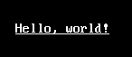

# [xieite](../../../../../xieite.md)\:\:[streams](../../../../../streams.md)\:\:[StandardHandle](../../../standard_handle.md)\:\:stringSetTextUnderlined\(\)
Defined in fragment [xieite:streams.StandardHandle](../../../../../../src/streams/standard_handle.cpp)

&nbsp;

## Description
Returns a string which enables or disables text <u>underlining</u> when printed.

&nbsp;

## Synopsis
#### 1)
```cpp
[[nodiscard]] static constexpr std::string stringSetTextUnderlined(bool value) noexcept;
```

&nbsp;

## Example
```cpp
import std;
import xieite;

int main() {
    std::string underlined = xieite::streams::StandardHandle::stringSetTextUnderlined(true);

    std::string message = underlined + "Hello, world!";

    std::println("{}", message);
}
```
Possible output:


